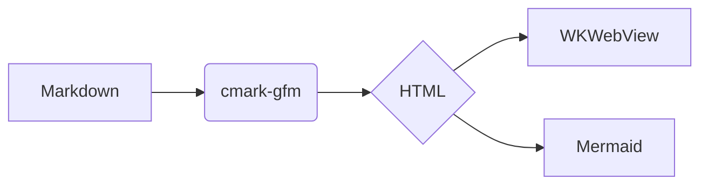

# VMD Sample

A quick tour of **GitHub Flavored Markdown** rendering, with `inline code`, ~~strikethrough~~, and a [link](https://example.com) plus a bare autolink: https://github.com/ewasserman/vmd

## Table

| Feature | Status | Notes |
|---------|--------|-------|
| Tables | ✅ | GFM pipes |
| Task lists | ✅ | checkboxes |
| Mermaid | ✅ | bundled, offline |

## Tasks

- [x] Scaffold project
- [x] Renderer with GFM extensions
- [ ] App icon

## Code

```swift
func greet(_ name: String) -> String {
    "Hello, \(name)!"
}
```

> A blockquote with a footnote reference.[^1]

## Diagram



---

Press <kbd>⌘O</kbd> to open another file.

[^1]: The footnote itself.
